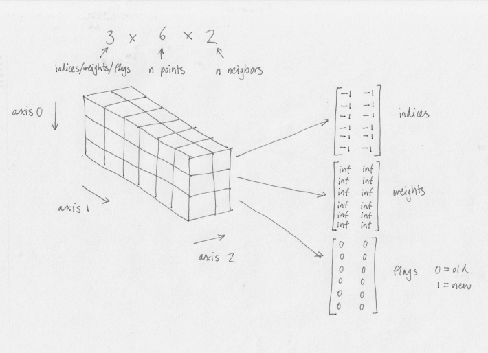

# PyNNDescent-Spark

An implementation of PyNNDescent in PySpark.

## Motivation

PyNNDescent is used in [Scanpy] to compute nearest neighbors for UMAP. For very large
numbers of samples this can take a long time. Running a distributed version of
PyNNDescent, using Spark will help speed this up.

### Data structures

The key data structures used in NNDescent are heaps, which hold the state of the
graph of nearest neighbors, and candidate neighbors. A heap is represented as a
three-dimensional NumPy array, and is illustrated below for a graph of nearest
neighbors for 6 points and 2 nearest neighbors.



Axis 0 indicates what the values stored in that slice represent: indices, weights,
or flags, corresponding to index values 0, 1, and 2.

Axis 1 corresponds to the row in the data. Axis 2 corresponds to the size of the
heap, so the number of nearest neighbors in the case shown in the diagram.

For axis 0 if the index value is 0, the values are the indices of the neighbors.
So for example, if `heap[0, i, j]` stored the value `k`, then that means that the data
point `i` has point `k` as a neighbor. The weight of the `i` to `k` link is
stored in `heap[1, i, j]`. Since it is a heap, the values are sorted along axis 2,
in ascending order of weight. The `heap[2, i, j]` values stores a flag indicating
if the candidate neighbor is new or not. This bookkeeping information is
used by the algorithm to avoid repeating work unnecessarily.

In the distributed implementation, arrays are chunked along axis 1, since this
is the number of points in the data, which may be millions or more for single cell
data.

### Distributed update of heaps

A distributed heap is an array with the structure described in the previous section,
and which has been split into equal sized chunks, or partitions.

A distributed heap can be updated in a MapReduce operation as follows. Each partition holds
a temporary copy of a sparse heap, initially empty. The Map phase adds entries
to the heap, which may occur at _any_ row index. The heap is limited in size since it
is sparse.

After all the updates have been applied to the temporary sparse heap for a given
partition, the heap must be chunked (using the same chunking as the original
distributed heap) into a series of sparse heap chunks. This results in a set of
`(index, sparse heap chunk)` pairs, where the index is the index of the sparse
heap chunk in the array. These pairs are emitted by the Map. If a sparse
heap chunk is empty for a given index then it is not emitted by the Map.

These pairs are shuffled by the key (the index), and the Reduce combines all the
sparse heap chunks for a given index, including the chunk for that index
from the original heap, to produce a final (dense) heap chunk for each partition.
The combine stage is simply a heap merge. The result is an updated distributed heap.

### The NNDescent algorithm

The heart of the algorithm is implemented in `nn_descent` in `pynndescent/pynndescent_.py`.

The main steps in the algorithm at a very high level are described by this pseudo code:

```
randomly initialize current graph
loop n times
    build candidate neighbors for current graph
    update current graph with candidate neighbors
```

Each of these steps is now discussed in the context of the distributed implementation.

#### Randomly initialize current graph

The graph is seeded with random connections with random weights. If there are
`N` data points and `K` nearest neighbors then `N * K` distances are computed.

The graph is represented as a distributed heap, as described in the previous
section. The Map operation seeds random connections from each chunk.

#### Build candidate neighbors for current graph

The candidate neighbors for a given point are the point's neighbors, and each of
the neighbors' neighbors.

There are two candidates heaps: one for new candidate neighbors, and one for old
candidate neighbors. (Only new neighbors need to be checked in the next step.)

In the distributed implementation, the current graph is partitioned, and each
chunk processed in its own partition. A pair of distributed heaps are used for
new and old candidate neighbors.

In the Map phase, the heaps are updated using information from the current graph
partition. (The local join optimization, described in [Dong], is the observation
that to find neighbors of neighbors, you don’t have to traverse `a -> b -> c`,
you just have to look at all (ordered) pairs in around `b`, which will include
`a` and `c`. In this way, the Map phase doesn't need to do a join with the rest
of the graph.)

The result is a chunked representation of the candidate neighbor heap. (Note that
the actual implementation is slightly more complicated since there are two heaps,
one for the new and one for the old candidates.)

#### Update current graph with candidate neighbors

This step involves using the candidate neighbor information to update the current
graph.

In the distributed implementation, the candidate neighbors heaps are partitioned,
and each chunk processed in its own partition. A distributed heap is used to
update the state of the graph using a MapReduce operation.

### Distance data

The data points are _not_ chunked in this algorithm. This is because when distances
are computed (during initialization and update of the current graph) the points
concerned are not constrained to the local chunk - they can be anywhere in the
data.

For this reason the data is distributed to all workers so they can compute distances.

Note that PCA is typically run on the data first (to avoid the curse of dimensionality),
so a 1 million row dataset with 50 dimensions would take around 400MB of storage.
This size is very feasible to distribute (e.g. via Spark broadcast), but for much
larger datasets alternative arrangements may be needed (e.g. load from Zarr storage
in the cloud).

### Sparse arrays

Sparse arrays are used for heap updates in MapReduce. The following table
lists the desired properties of sparse arrays for this purpose.

| Property         | Dictionary Of Keys | COOrdinate         | LInked List        | Compressed Sparse Row | pydata.sparse.DOK  |
| ---------------- | ------------------ | ------------------ | ------------------ | --------------------- | ------------------ |
| Subscriptable    | :white_check_mark: | :x:                | :white_check_mark: | :white_check_mark:    | :white_check_mark: |
| Item assignment  | :white_check_mark: | :x:                | :white_check_mark: | :white_check_mark:*   | :white_check_mark: |
| `vstack`         | :white_check_mark: | :white_check_mark: | :white_check_mark: | :white_check_mark:    | :white_check_mark: |
| Sparse rows      | :white_check_mark: | :white_check_mark: | :x:                | :white_check_mark:    | :white_check_mark: |
| Fill value       | :x:                | :x:                | :x:                | :x:                   | :white_check_mark: |
| 3D               | :x:                | :x:                | :x:                | :x:                   | :white_check_mark: |

- Subscriptable: ability to access an entry by index, e.g. `A[i, j]`
- Item assignment: ability to update an entry by index, e.g. `A[i, j] = x`
- `vstack`: ability to vertically stack chunks of sparse arrays together
(also called `concatenate`)
- Sparse rows: no storage is used for empty rows. This is not
the case for LIL, since an empty list is stored for empty rows.
- Fill value - specify a default fill value
- 3D - support three dimensions

`*` CSR arrays technically support item assignment,
but it's expensive so shouldn't be used to build sparse matrices.

None of the `scipy.sparse` implementations support fill values or 3D matrices,
but the `pydata.sparse` implementations do.

Summary: DOK is the only sparse implementation that is appropriate for doing
heap updates. COO and CSR don't support efficient inserts, and LIL is not space
efficient since it stores an empty list for empty rows.

### Usage

```
python3 -m venv venv  # python 3 is required!
. venv/bin/activate

pip install -e .
pip install pyspark==2.3.1 pytest
```

[Dong]: http://www.cs.princeton.edu/cass/papers/www11.pdf
[Scanpy]: https://scanpy.readthedocs.io